# Engineering Electromagnetic Field Experiment 1 Report

This is the report fo the first experiment of Engineering Electromagnetic Field course, written by HUANG Guanchao, SID 11912309 from SME. The complete resources of this experiment, including `.m` source code, report in `.md`, `.pdf` format and all the figures can be retrieved at [my GitHub repo](https://github.com/SamuelHuang2019/EEF-lab/tree/main/experiment_1).

>These works are done with MATLAB 2020b and VSCode.

[toc]

---

## General Idea

The general idea of my coding, is to capsulate the workflow of plotting several figures into corresponding customized functions, taking charges, with their amount and location as parameters, to achieve high code reuse rate, and to reduce duplicated lines as many as possible.

In all, five functions are implemented, one for calculating the potential distribution, and the other four are for generating the figures required in this experiment.

---

## Function `potential()`

This method is intended for calculating the electric potential distribution due to one or more point charges. It requires 3 parameters:

### Parameters

This function is invoked as `potential(charges, xm, ym)`.

- `charges`
This parameter is for the charge distribution, it is a matrix with 3 rows and three columns, each row vector of which specifies a point charge. In rows of `charges`, the first element is the charge amount, the second is the $x$-coordinate, and the third is the $y$-coordinate.

- `xm`
This parameter represents the maximum absolute value of the $x$-coordinates on which the potential is calculated. In another word, the range we are concerned along the $x$-axis is $[-x_m, x_m]$.

- `ym`
Similar to `xm`, but along the $y$-axis.

### Returns

This function returns a **cell** of three matrices, noted as `V`.

1. the first indicates the potential at each points in the range.
2. the second indicates the $x$-coordinate of the meshgrid.
3. the third indicates the $y$-coordinate of the meshgrid.

>Since MATLAB doesn't support a matrix composed of matrices, hence a `cell` type is required.

### Detailed Explanation

Inside the function, firstly, the $x$-coordinates in the range are evenly divided to 50 segments with command `x = linspace(-xm, xm, 50);`, stored in a row vector. Then the same for the $y$-coordinates. Based on this, the meshgrid is generated as `[X, Y] = meshgrid(x, y);`

>The meshgrid is set to have size of 50 by 50, in order to achieve the relatively best appearance for all 4 figures needed to be accomplished in this experiment.

Afterwards, the distance between each of the point charges to, and hence the potential due to each of them at any points in the meshgrid are calculated iteratively within `for` loop, then summed to form the return.

>Due to the same limitation mentioned above, calculation inside functions is also based on the `cell` type.

### Source Code

The complete source code of this function is shown in the following code block.

>`k` is a global variable defined outside of the function block, representing the electrostatic constant.

```matlab
%% potential
function V = potential(charges, xm, ym)
    % potential - to calculate the electric potential distribution
    %
    % input -
    %   charges - a matrix with 3 rows,
    %            column 1 indicates point charge amount;
    %            column 2 indicates x-coordinate;
    %            column 3 indicates y-coordinate
    %   xm - the range of the field in x direction
    %   ym - the range of the field in y direction
    %
    % output -
    %   V - a cell of three matrices,
    %      the first indicates the potential at each points in the range
    %      the second indicates the x-coordinate of the meshgrid
    %      the third indicates the y-coordinate of the meshgrid

    % evenly divide the x axis into 50 segments
    x = linspace(-xm, xm, 50);
    % evenly divide the y axis 50 segments
    y = linspace(-ym, ym, 50);

    % to form the coordinates of each point in the field.
    [X, Y] = meshgrid(x, y);

    % calculate the distance between each point and the source charge (the origin).
    R = {};

    for index = 1:size(charges, 1)
        R{index} = ...
            sqrt((X - charges(index, 2)).^2 + ...
            (Y - charges(index, 3)).^2);
    end

    % calculate the electric potential of each point
    % V = k * Q ./ R;
    global k
    V_q = {};

    for index = 1:size(charges, 1)
        V_q{index} = ...
            k * charges(index, 1) ./ R{index};
    end

    V_total = sum(cat(3, V_q{:}), 3);
    V = {V_total, X, Y};

end
```

---

## Function `plot_potential()`

This function is invoked as `plot_potential(V)`, takes in a potential distribution `V`, which is a result of `potential()`, then generates a figure using `mesh()`.

>Since there's a line of `figure` command, each time this function runs, a new figure window is generated.

The complete source code of this function is shown in the following code block.

```matlab
%% plot_potential
function plot_potential(V)
    % potential - to plot the electric potential distribution
    % input arguments -
    %   V - a cell of three elements,
    %      the first indicates the x-coordinate of the meshgrid
    %      the second indicates the y-coordinate of the meshgrid
    %      the third indicates the potential at each points in the range

    figure
    mesh(V{2}, V{3}, V{1})

    % The title for the plot(Note that all symbols should be half-angled English characters )
    title("The plot of electric potential distribution of point charge(s) in the vacuum");
    % label the x axis
    xlabel('X axis (unit: m)', 'fontname', 'Times New Roman');
    % label the y axis
    ylabel('Y axis (unit: m)', 'fontname', 'Times New Roman');
end
```

---

## Function `plot_potential_contours()`

This function is for plotting the contours of electric field potential due to one or more charges.

>All the functions for plotting figures are similar, invocation would lead to the generation of new figure windows.

### Parameters

This function is invoked as `plot_potential_contours(charges, xm, ym, Vmin, Vmax)`.

>The parameters of the same notation are identical for each functions, therefore won't be repeatedly explained in the following content.

- `charges`
- `xm`
- `ym`
- `Vmin`
The minimum potential value for a family of equipotential lines.
- `Vmax`
The maximum potential value for a family of equipotential lines.

### Detailed Explanation

Inside the function, the potential distribution is calculated first by invoking `potential()`. Then, a family of equipotential values are formed with command `Veq = linspace(Vmin, Vmax, 30);`. The figure is then plotted with `contour()` function. In the end, the location of the point charges are also labeled iteratively.

>The amounts of equipotential lines is set to be 30 to improve appearance.

### Source Code

The complete source code of this function is shown in the following code block.

```matlab
%% plot_contours
function plot_contours(charges, xm, ym, Vmin, Vmax)
    % plot_contours - to plot the contours distribution
    % input arguments -
    %   charges - a matrix with 3 rows,
    %            row 1 indicates point charge amount
    %            row 2 indicates x-coordinate
    %            row 3 indicates y-coordinate
    %   xm - the range of the field in x direction
    %   ym - the range of the field in y direction
    %   Vmin - the minimum potential value for a family of equipotential lines
    %   Vmax - the maximum potential value for a family of equipotential lines

    V = potential(charges, xm, ym);
    % set the potential for 30 equipotential lines
    Veq = linspace(Vmin, Vmax, 30);

    % plot 30 equipotential lines
    figure
    contour(V{2}, V{3}, V{1}, Veq);
    % form a grid
    grid on
    % hold the plot
    hold on

    % plot the charges
    for index = 1:size(charges, 1)
        x = charges(index, 2);
        y = charges(index, 3);
        plot(x, y, '*', 'MarkerSize', 12)
    end

    title('Isopotential lines of point charge(s) electric field in vacuum');
    % title the plot
    % label the x axis
    xlabel('X axis (unit: m)', 'fontname', 'Times New Roman');
    % label the y axis
    ylabel('Y axis (unit: m)', 'fontname', 'Times New Roman');

end
```

---

## Function `plot_potential_contours_streamlines()`

This function is for plotting the contours of electric field potential and the electric field streamlines due to one or more charges.

### Parameters

This function is invoked as `plot_potential_contours_streamlines(charges, xm, ym, Vmin, Vmax)`.

- `charges`
- `xm`
- `ym`
- `Vmin`
- `Vmax`

### Detailed Explanation

This function utilized `potential()` to find the potential distribution, and then `gradient()` to calculate the electric field intensity.

A series of radian value `theta` is formed to obtain a set of start points of streamlines. To improve appearance of our plots, the streamlines should not all start at the charges. Instead, we use trigonometric functions to generate a series of start points that are at a specific distance, in our case, one twentieth of the range from the charges.

```matlab
    for index = 1:size(charges, 1)
        % generate the x coordinate for the start of the field line
        x = charges(index, 2);
        xs = [xs, x + xm / 20 * cos(theta)];
        % generate the x coordinate for the start of the field line
        y = charges(index, 3);
        ys = [ys, y + ym / 20 * sin(theta)];
    end
```

However, such procedure still can not deal with negative charges, since streamlines ends on them instead of starting.

### Source Code

The complete source code of this function is shown in the following code block.

```matlab
function plot_contours_streamlines(charges, xm, ym, Vmin, Vmax)
    % plot_contours_streamlines - to plot the contours distribution
    % input arguments -
    %   charges - a matrix with 3 rows,
    %            row 1 indicates point charge amount;
    %            row 2 indicates x-coordinate;
    %            row 3 indicates y-coordinate
    %   xm - the range of the field in x direction
    %   ym - the range of the field in y direction
    %   Vmin - the minimum potential value for a family of equipotential lines
    %   Vmax - the maximum potential value for a family of equipotential lines

    V = potential(charges, xm, ym);
    figure
    % form a grid
    grid on

    % set the potential for 30 equipotential lines
    Veq = linspace(Vmin, Vmax, 30);
    % plot 30 equipotential lines
    contour(V{2}, V{3}, V{1}, Veq);
    % hold the plot
    hold on

    % plot streamlines
    % calculation of two components of Electric Field intensity at each Point in the Field
    [Ex, Ey] = gradient(-V{1});
    % set the angle difference between adjacent field lines
    del_theta = 15;
    % express the angle into radian
    theta = (0:del_theta:360) .* pi / 180;
    xs = [];
    ys = [];

    for index = 1:size(charges, 1)
        % generate the x coordinate for the start of the field line
        x = charges(index, 2);
        xs = [xs, x + xm / 20 * cos(theta)];
        % generate the x coordinate for the start of the field line
        y = charges(index, 3);
        ys = [ys, y + ym / 20 * sin(theta)];
    end

    xs = [xs, 10 * xm * cos(theta)];
    ys = [ys, 10 * ym * sin(theta)];

    % generate the field lines
    streamline(V{2}, V{3}, Ex, Ey, xs, ys)
    % hold the plot
    hold on

    % plot the charges
    for index = 1:size(charges, 1)
        x = charges(index, 2);
        y = charges(index, 3);
        plot(x, y, '*', 'MarkerSize', 12)
    end

    % title the plot
    title({('Isopotential lines and power lines of point charge(s) electric field in vacuum'); ...
            ('(Expressed by Smooth Continuous Curves)')}, 'fontsize', 12)
    % label the x axis
    xlabel('X axis(unit: m)', 'fontsize', 12, 'fontname', 'Times New Roman')
    % label the y axis
    ylabel('Y axis (unit: m)', 'fontsize', 12, 'fontname', 'Times New Roman')
end
```

---

## Function `plot_potential_contours_streamlines_arrow()`

This function is almost identical with `plot_potential_contours_streamlines()`, but with unified arrows for visualizing the streamlines.

```matlab
function plot_contours_streamlines_arrow(charges, xm, ym, Vmin, Vmax)
    % plot_contours_streamlines - to plot the contours distribution
    % input arguments -
    %   charges - a matrix with 3 rows,
    %            row 1 indicates point charge amount;
    %            row 2 indicates x-coordinate;
    %            row 3 indicates y-coordinate
    %   xm - the range of the field in x direction
    %   ym - the range of the field in y direction
    %   Vmin - the minimum potential value for a family of equipotential lines
    %   Vmax - the maximum potential value for a family of equipotential lines

    V = potential(charges, xm, ym);
    % calculation of two components of Electric Field intensity at each Point in the Field
    [Ex, Ey] = gradient(-V{1});

    % calculate the magnitude of electric field magnitude at each point.
    E = sqrt(Ex.^2 + Ey.^2);
    Ex = Ex ./ E;
    % normalize the magnitude of the electric field
    Ey = Ey ./ E;
    figure
    % using normalized arrowhead to represent electric field
    s = fix(size(V{3}) / 15);
    quiver(V{2}(1:s:end, 1:s:end), ...
        V{3}(1:s:end, 1:s:end), ...
        Ex(1:s:end, 1:s:end), ...
        Ey(1:s:end, 1:s:end))
    hold on

    % set the potential for 30 equipotential lines
    Veq = linspace(Vmin, Vmax, 30);
    % plot the equipotential lines
    contour(V{2}, V{3}, V{1}, Veq)
    hold on

    % plot the charges
    for index = 1:size(charges, 1)
        x = charges(index, 2);
        y = charges(index, 3);
        plot(x, y, '*', 'MarkerSize', 12)
    end

    % title the graph
    title({('Equipotential lines and electric field lines of point charge(s) electric field in vacuum'); ...
            ('(represented by normalized arrowhead)')}, 'fontsize', 12)
    % label the X axis
    xlabel('X axis(unit:m)', 'fontsize', 12, 'fontname', 'Times New Roman')
    % label the Y axis
    ylabel('Y axis(unit:m)', 'fontsize', 12, 'fontname', 'Times New Roman')

end
```

## Main Script

The functions defined are invoked in the main MATLAB script to accomplish the experiment.

### Detailed Explanation

In the header of the main script, several commands are executed, and a global variable `k` for the electrostatic constant is initialized.

```matlab
% clear all variables in memory
clear
% clear the figures window
close all
% set electrostatic constant
global k
k = 9e9;
```

Then, three `cell` objects are created, representing the charges.

```matlab
charges_1 = [1e-9, -0.01, 0; 1e-9 0.01 0];
charges_2 = [5e-9, -2, 0; -5e-9 2 0];
charges_3 = [8e-9, -sqrt(3), -1; 8e-9 sqrt(3) -1; 8e-9, 0, 2];
```

The following work then would be trivial, just calling the functions we have already defined.

One last novel work is that, we use a `for` loop to save all the plots generated. In each iteration, we use the `index` as the handle to the figure window, then obtain the axis area with `get(index, 'CurrentAxes')`. Then, the plots are saved to the directory by `exportgraphics()` function with a certain file name.

```matlab
% save all the figures
for index = 1:12
    exportgraphics(get(index, 'CurrentAxes'), ['experiment_1_figure_', num2str(index), '.png'], 'Resolution', 600)
end
```

### Source Code

```matlab
% clear all variables in memory
clear
% clear the figures window
close all
% set electrostatic constant
global k
k = 9e9;

charges_1 = [1e-9, -0.01, 0; 1e-9 0.01 0];
charges_2 = [5e-9, -2, 0; -5e-9 2 0];
charges_3 = [8e-9, -sqrt(3), -1; 8e-9 sqrt(3) -1; 8e-9, 0, 2];

% calculate electric potential distribution
potential_1 = potential(charges_1, 0.02, 0.02);
potential_2 = potential(charges_2, 5, 5);
potential_3 = potential(charges_3, 5, 5);

% plot electric potential distribution
plot_potential(potential_1)
plot_potential(potential_2)
plot_potential(potential_3)

% plot potential contours
plot_contours(charges_1, 0.02, 0.02, 200, 2000);
plot_contours(charges_2, 5, 5, -25, 25);
plot_contours(charges_3, 5, 5, 0, 200);

% plot electric field streamlines and potential contours
plot_contours_streamlines(charges_1, 0.02, 0.02, 200, 2000);
plot_contours_streamlines(charges_2, 5, 5, -25, 25);
plot_contours_streamlines(charges_3, 5, 5, 0, 200);

% plot potential field streamlines represented in unified arrows and contours
plot_contours_streamlines_arrow(charges_1, 0.02, 0.02, 200, 2000);
plot_contours_streamlines_arrow(charges_2, 5, 5, -25, 25);
plot_contours_streamlines_arrow(charges_3, 5, 5, 0, 200);

% save all the figures
for index = 1:12
    exportgraphics(get(1, 'CurrentAxes'), ['experiment_1_figure_', num2str(index), '.png'], 'Resolution', 600)
end
```

## Plots and Analysis

This part shows the plots generated and correspondingly their analysis.

### Point Charge Distribution 1

In the first case, two positive points charges with the same charge amount are introduced. Therefore, all of the four plots shows symmetry with respect to the $y$-axis. The potential shows two peaks in the plot, which goes to infinity at the points where the charges are located.

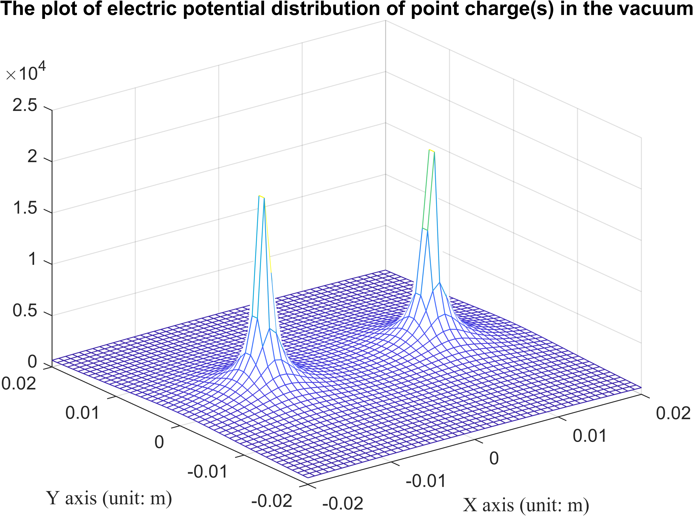

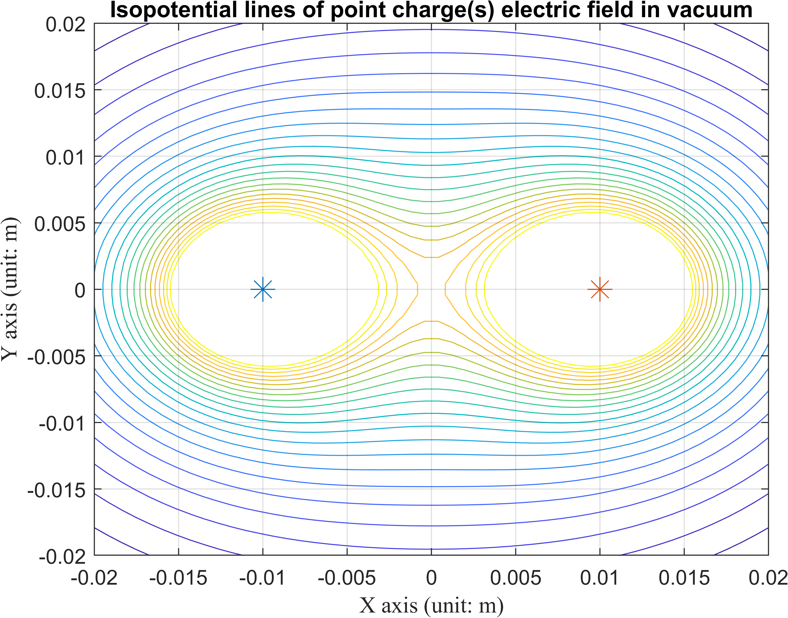

As for the electric field intensity, the streamlines are all starts from the two charges, pointing outwards.

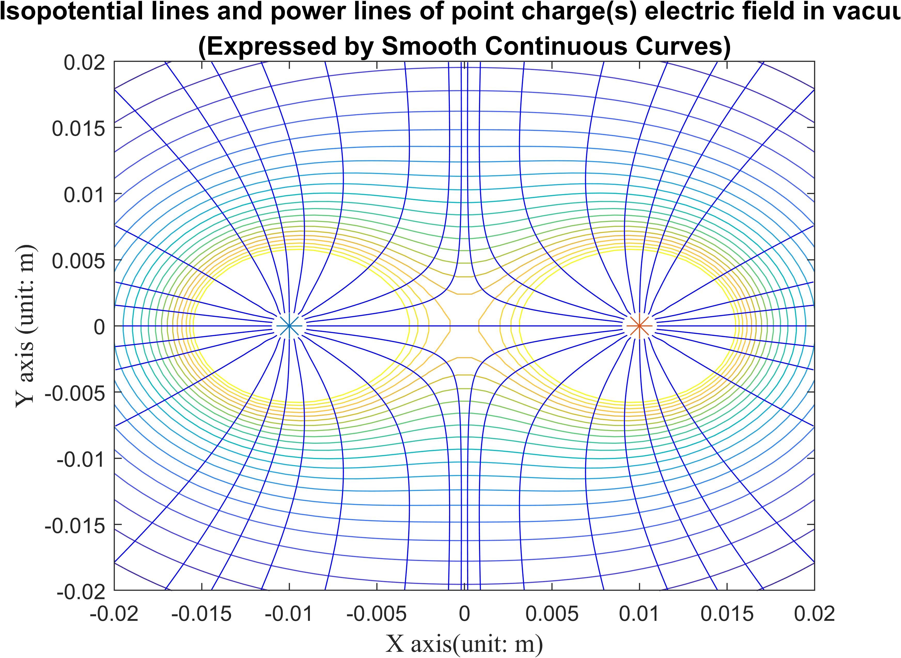

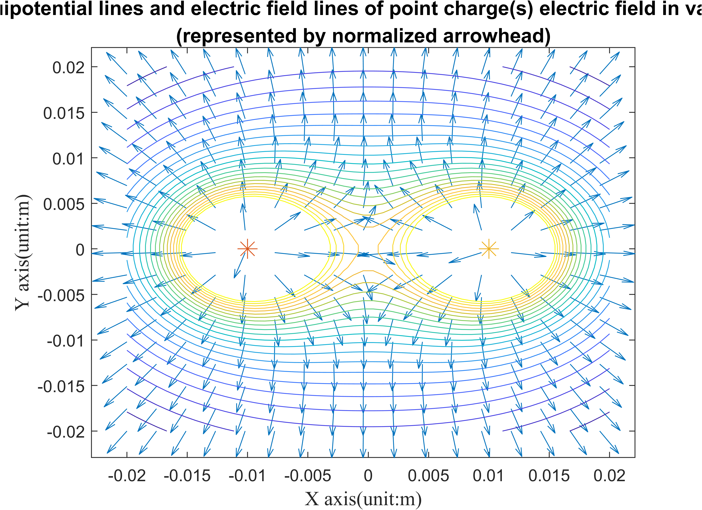

### Point Charge Distribution 2

Case 2 is similar to case 1, except that a point charge is switched to a negative one.

As a result, on the plot, the potential shows a peak for positive infinity and a valley for negative infinity.

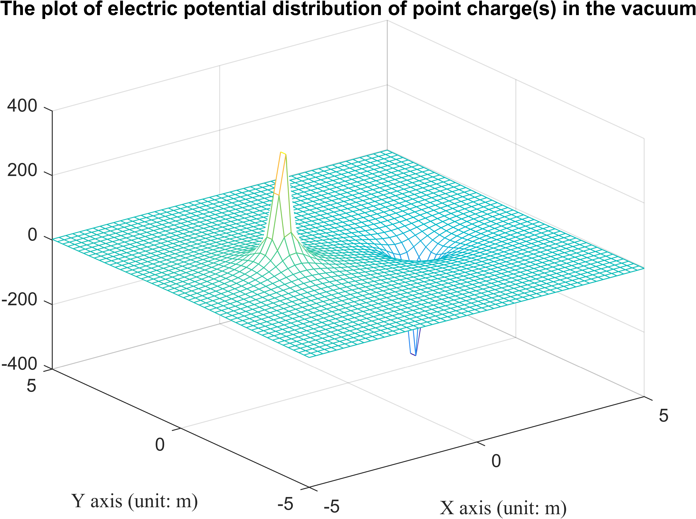

The contours plot is similar to two group of concentric circles "squeezing" each other. Notice that, the $y$-axis itself also becomes a contour line with infinity radius.

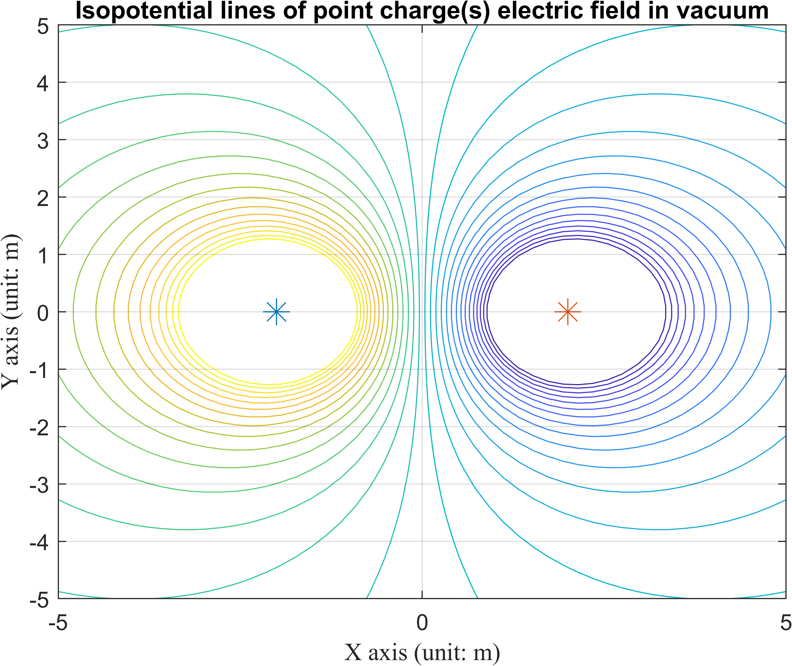

As for the electric field intensity, the streamlines, or more intuitively for the arrows, are all forming a path from the positive charge to the negative one.

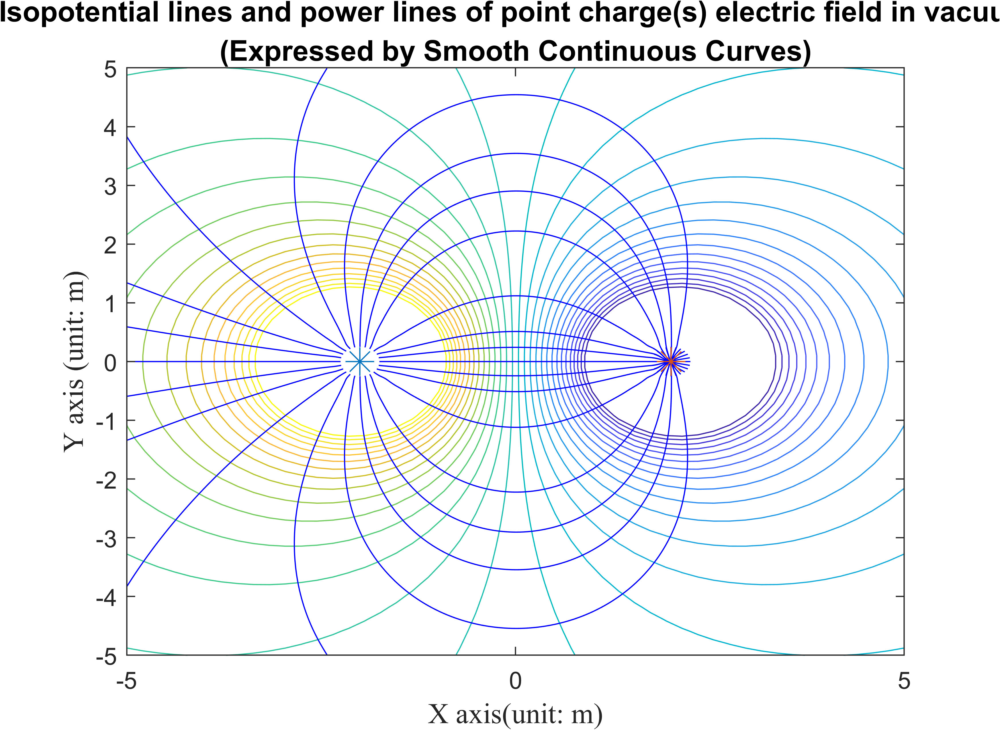

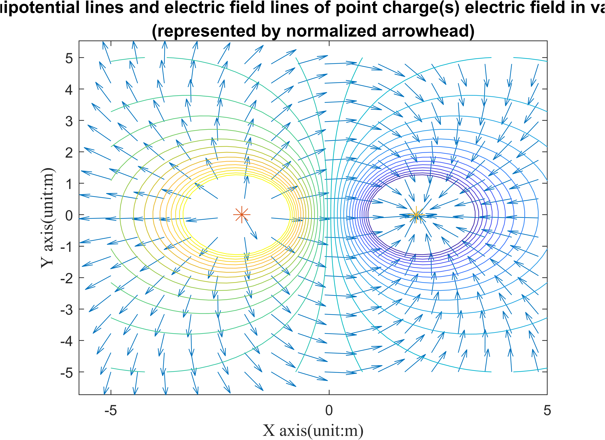

### Point Charge Distribution 3

Case 3 is also similar to case 1, but with one additional identical point charge. Hence, in the plots, three peaks and three centers are exhibited.

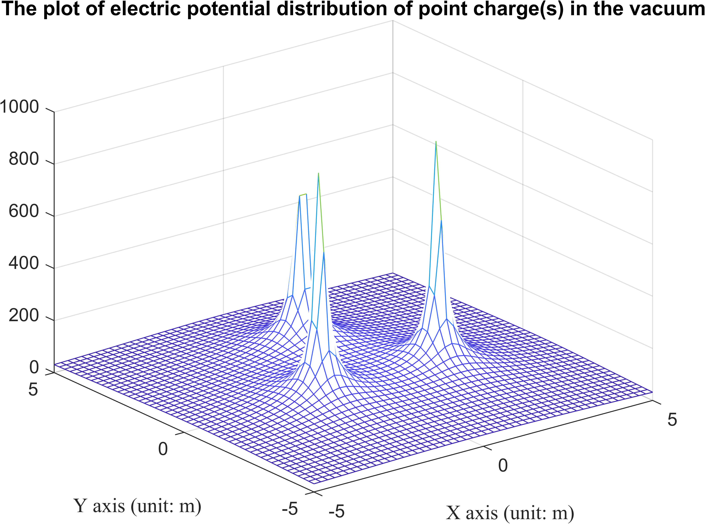

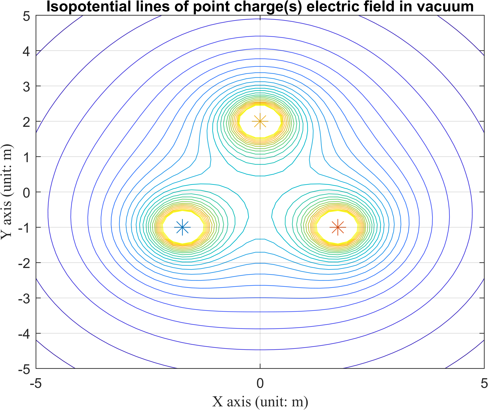

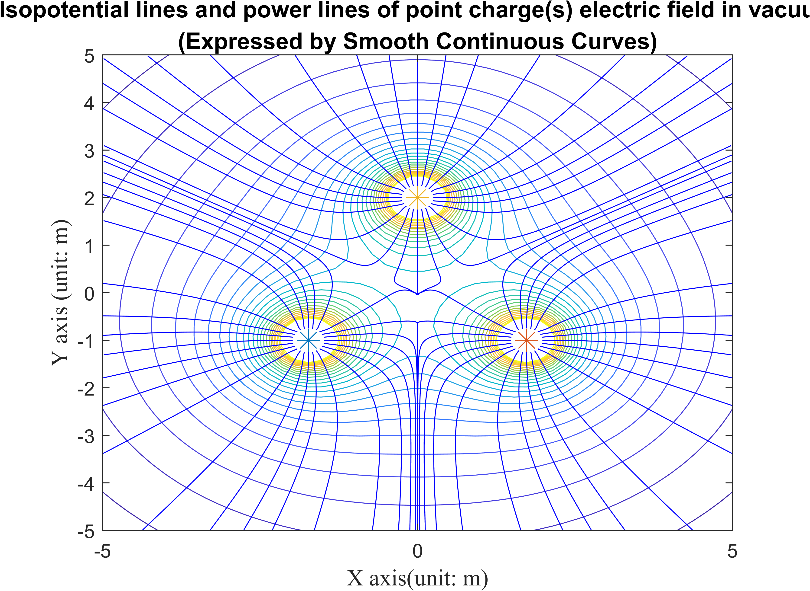

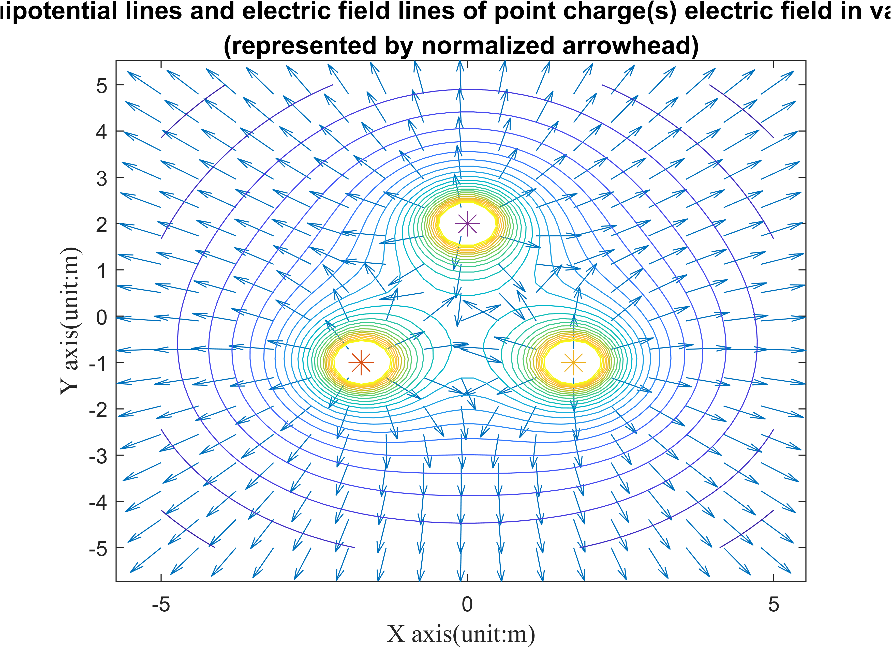
