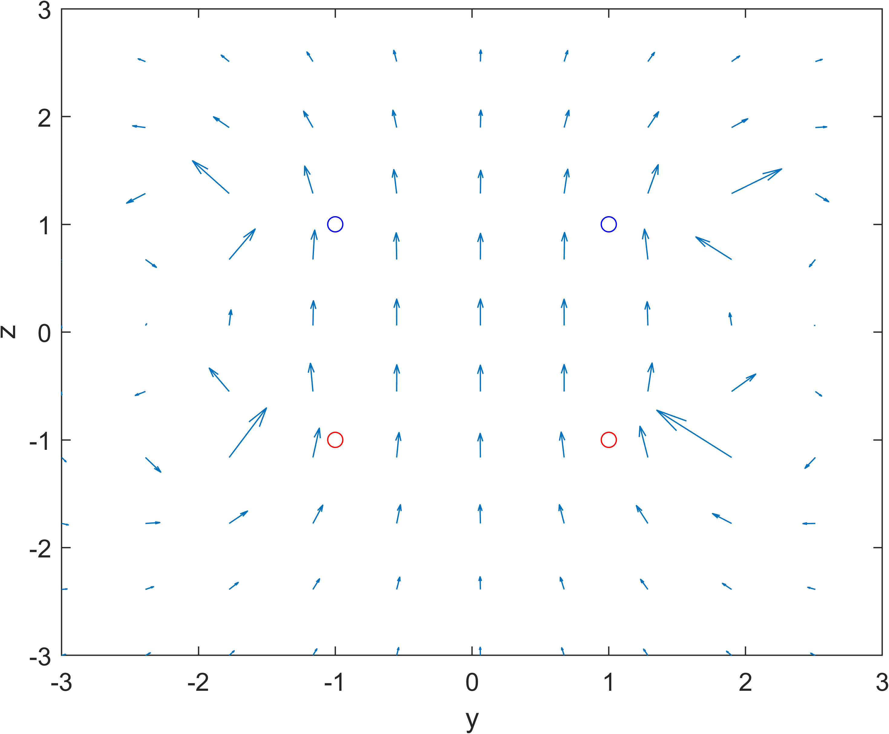
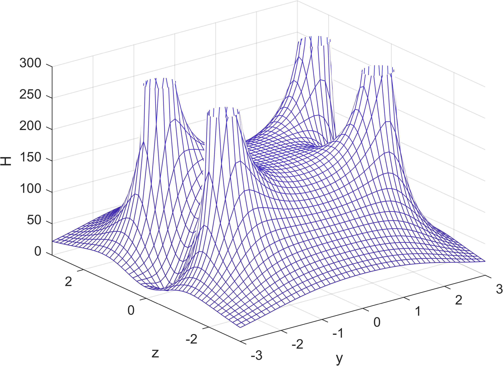
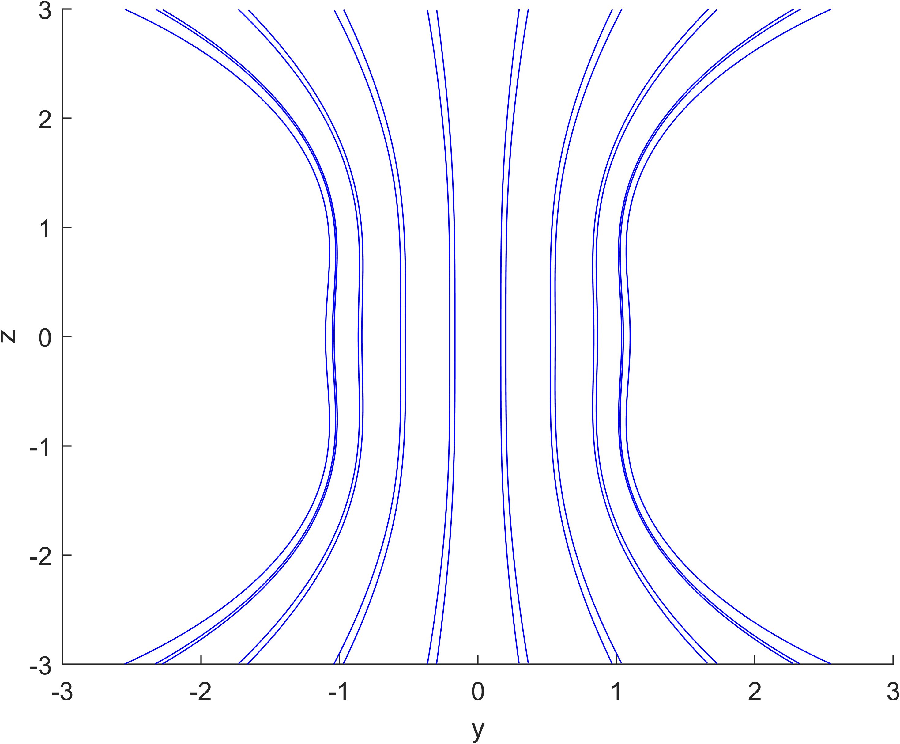
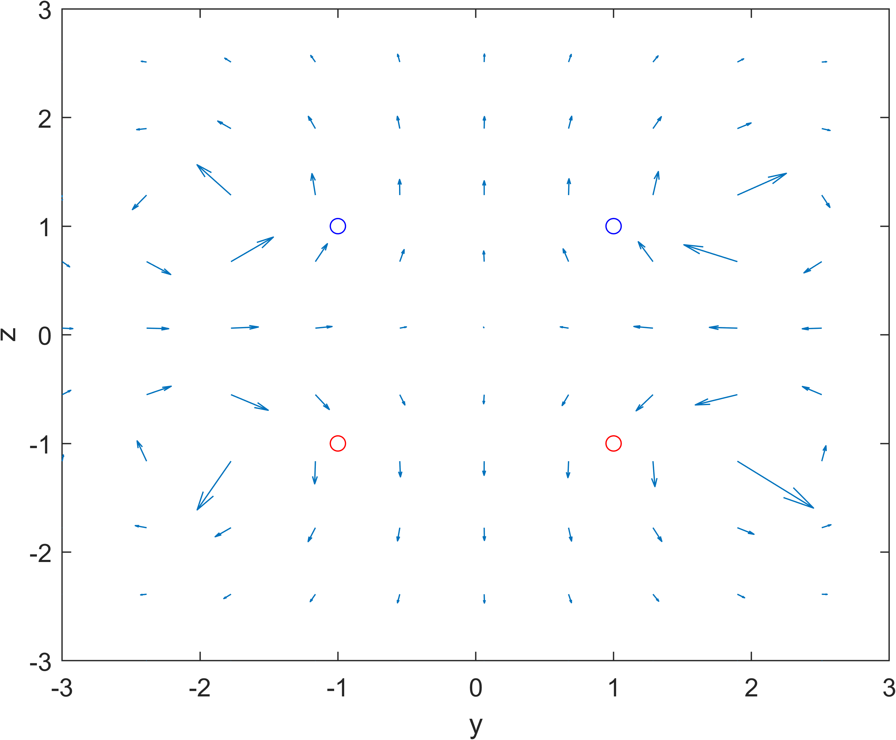
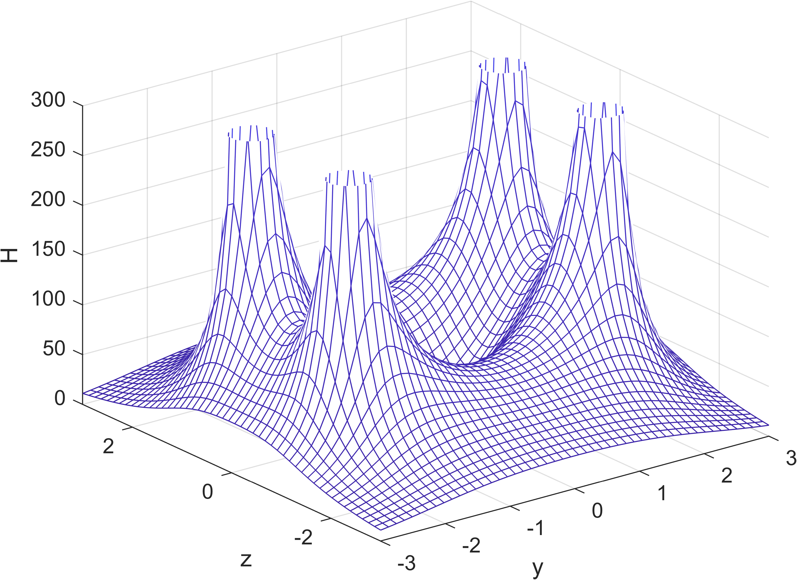
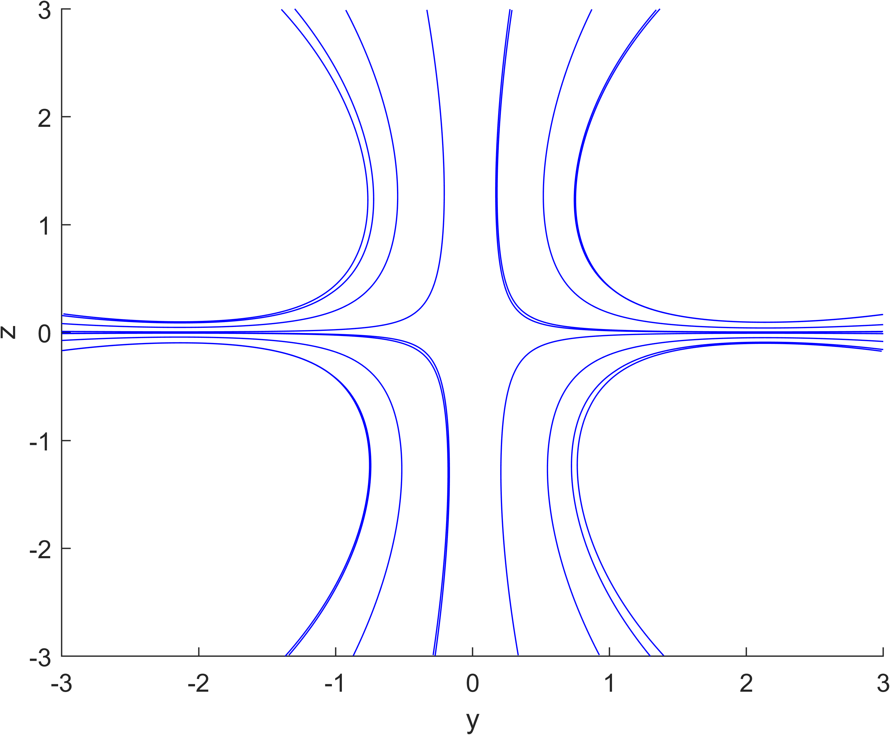

# Engineering Electromagnetic Field Experiment 3 Report

This is the report for the first experiment of Engineering Electromagnetic Field course, written by HUANG Guanchao, SID 11912309 from SME. The complete resources of this experiment, including `.m` source code, report in `.md`, `.pdf` format and all the figures can be retrieved at [my GitHub repo](https://github.com/SamuelHuang2019/EEF-lab/tree/main/experiment_3).

>These works are done with MATLAB 2020b and VSCode.

[toc]

---

## Objectives

1. Get familiar with the spatial magnetic field that is produced by an electric current loop.
2. Calculate the magnetic field distribution and plot the relevant graphs through MATLAB.

## Related Knowledge

Biot and Savart derived the expression of the magnetic field created by an elementary current, which is called as Biot–Savart law.

$$
d\mathbf{H} =
\frac{I\mathop{d\mathbf{L}\times\mathbf{a}_R}}{4\pi R^2} =
\frac{I\mathop{d\mathbf{L}}\times\mathbf{R}}{4\pi R^3}
$$

where $\mathbf{H}$ is magnetic field intensity vector, $I\mathop{d\mathbf{L}}$ is elementary current vector, $\mathbf{R}$ is the vector that points from the elementary current $I\mathop{d\mathbf{L}}$ to a field point $P$ and its magnitude is $R$.

As for the magnetic field created by an electric current loop, we have used the Biot–Savart law to derive the distribution of the magnetic field intensity along the center axis of the current loop:

$$
\mathbf{H} =
\frac{I(\pi a^2)\mathbf{a}_z}{2\pi(a^2 + z_0^2)^{3/2}}
$$

Where $a$ is the radius of the current loop, $I$ is the current in the current loop, $z_0$ is the coordinate of the field point (located on the center axis, i.e. $z$ axis). However, for the field points that are not on the center axis, it would be hard to deploy Biot–Savart law to derive an analytical solution for the magnetic field intensity.

Similarly, magnetic field also follows the superposition principle. Therefore, we can divide the current-carrying conductor into many elementary currents. Thus, the magnetic field created by the current-carrying conductor is equal to the superposition of the magnetic fields created by all elementary currents. Based on this, we can use MATLAB program to find the distribution of the magnetic field created by an electric current loop at any field point.

<!-- Likewise, an electric current loop with radius $a$ is located in the $xy$ plane and its center is located at the origin $O$. The magnitude of the current in the loop is $I$ and the direction of the current is shown as the arrow in figure 2. For simplicity, we will only analyze the yz plane distribution of the magnetic field 
created by the current loop -->

---

## Code Implementation

Common variables are define in the header. To optimize appearance, the coordinate plane is divided into 50 by 50 mesh grid.

```matlab
% Set the range of y direction in the field domain
zm = 3;
% Set the range of z direction in the field domain
ym = 3;
% Equally divide y axis into 20 parts
global y
y = linspace(-ym, ym, 50);
% Equally divide z axis into 20 parts
global z
z = linspace(-zm, zm, 50);
```

To achieve hight cohesion and low coupling, two customized functions are introduced.

### Function `magnetic_field_intensity()`

This function take in one parameter `zc`, which is the $z$ coordinate where the current loop is located. And returns 3 value, `H` for the magnitude of the magnetic field intensity on the $yz$ plane, and accordingly, `Hy` for the $y$ component, `Hz` for the $z$ component.

The source code of this part is shown in the code block below.

```matlab
function [H, Hy, Hz] = magnetic_field_intensity(zc)

    % Input the radius of the current loop
    a = 2;
    % Input the current value in the current loop
    I = 500;
    % Merge the constants
    C = I / (4 * pi);

    % Set the number of division
    N = 50;
    % Division of the angle of circumference
    theta0 = linspace(0, 2 * pi, N + 1);
    theta1 = theta0(1:N);
    theta2 = theta0(2:N + 1);

    % The start point coordinate of each segment of the loop
    x1 = a * cos(theta1);
    y1 = a * sin(theta1);
    % The ending point coordinate of each segment of the loop
    x2 = a * cos(theta2);
    y2 = a * sin(theta2);

    % Calculate the 3 coordinate components of the midpoint of each segment of the loop
    xc = (x2 + x1) ./ 2;
    yc = (y2 + y1) ./ 2;

    % Calculate the 3 length components of each segment
    % vector dl
    dlz = 0;
    dlx = x2 - x1;
    dly = y2 - y1;

    %Grid dimension
    NGx = 50;
    NGy = 50;

    % Construct the H matrix
    Hy = zeros(50);
    Hz = zeros(50);
    H = zeros(50);

    global y
    global z

    % Loop computation of the value of H(x, y) in each grid
    for i = 1:NGy

        for j = 1:NGx
            % Calculate the 3 length components of the radius vector r, and r is in the z = 0 plane
            rx = 0 - xc;
            ry = y(j) - yc;
            rz = z(i) - zc;

            % Calculate r cube
            r3 = sqrt(rx.^2 + ry.^2 + rz.^2).^3;

            % Calculate the y, z components of the cross product dl×r, x component is 0
            dlXr_y = dlz .* rx - dlx .* rz;
            dlXr_z = dlx .* ry - dly .* rx;

            % Accumulate the magnetic field intensity created by each segment of the loop.
            Hy(i, j) = sum(C .* dlXr_y ./ r3);
            Hz(i, j) = sum(C .* dlXr_z ./ r3);

            % Calculate the magnitude of H
            H = (Hy.^2 + Hz.^2).^0.5;
        end

    end

end
```

### Function `magnetic_field_plot()`

This function takes in 3 parameters, `H`, `Hy` and `Hz`, corresponding to the 3 return value of `magnetic_field_intensity()`. Running this function would generate 3 figures, a quiver vector plot of the magnetic field intensity, the magnitude distribution of the magnetic field intensity, and the magnetic induction lines.

>To avoid the arrows in quiver plot being too short, the numbers of coordinates and magnetic field intensity values are reduced to one fifth, that is, a 10 by 10 plot.

```matlab
function magnetic_field_plot(H, Hy, Hz)

    global y
    global z

    % Plot the vector graph of the magnetic field intensity
    figure
    quiver(y(1:5:end, 1:5:end), z(1:5:end, 1:5:end), Hy(1:5:end, 1:5:end), Hz(1:5:end, 1:5:end))
    axis([-3, 3, -3, 3])
    hold on
    % Standard coil section
    plot(1, -1, 'ro', -1, -1, 'ro', 1, 1, 'bo', -1, 1, 'bo')
    % Label the axis
    xlabel('y')
    ylabel('z')

    % Plot the graph of magnetic field intensity
    figure
    mesh(y, z, H)
    axis([-3, 3, -3, 3, 0, 100])
    xlabel('y')
    ylabel('z')
    zlabel('H')

    % Set the radian value of the streamlines
    theta = [0 50 60 70 80 90 100 110 120 130 180] .* pi / 180;
    % Set the streamline starting circle’s y coordinate
    ys = 1.1 * cos(theta);
    % Set the streamline starting circle’s z coordinate
    zs = 1.1 * sin(theta);

    % Outwardly plot the magnetic line of force from the starting circle.
    figure
    streamline(y, z, Hy, Hz, ys, zs)
    % Inwardly plot the magnetic line of force from the starting circle.
    streamline(y, z, -Hy, -Hz, ys, zs)
    xlabel('y')
    ylabel('z')
end
```

---

## Experiment Content

The MATLAB script is used for simulating the magnetic field behaviors of two parallel current loop. The two loops are both of radius $a = 2\mathrm{m}$, parallel to $xy$ plane, and centered at the $z$ axis. One centered at $z  = -1$, another at $z = 1$.

### Case 1

In this case, the direction in the two loops are identical, particularly, both counterclockwise when looking from positive $z$. This is realized by summing the magnetic field intensity due to the two current loops.

>Notice that, the magnitude of the magnetic field intensity is not the simple sum of the magnitude due to the two current loops. It is necessary calculating the components of the resulting magnetic field first, then calculate the magnitude.

```matlab
% Case 1
[~, Hy1, Hz1] = magnetic_field_intensity(1);
[~, Hy2, Hz2] = magnetic_field_intensity(-1);
Hy = Hy1 + Hy2;
Hz = Hz1 + Hz2;
H = sqrt(Hy.^2 + Hz.^2);
magnetic_field_plot(H, Hy, Hz)
```

>For two parallelly placed current loops, when the distance between them is equal to their radius, this two-current-loops system is usually called Helmholtz coils. One characteristic of the Helmholtz coils is that the spatial magnetic field distribution between these two current loops is very uniform.

From the quiver vector plot, it is clear shown that the magnetic field between the loops is uniformly distributed.



This figure shows the magnitude of the magnetic field intensity.



According to the figure, we can see that, inside the Helmholtz coils, the magnetic induction lines are nearly parallel.



### Case 2

In this case, the direction in the two loops are different, this is realized by taking difference of the magnetic field intensity due to the two current loops.

```matlab
% Case 2
[~, Hy1, Hz1] = magnetic_field_intensity(1);
[~, Hy2, Hz2] = magnetic_field_intensity(-1);
Hy = Hy1 - Hy2;
Hz = Hz1 - Hz2;
H = sqrt(Hy.^2 + Hz.^2);
magnetic_field_plot(H, Hy, Hz)
```

From the plot, we can see that the magnetic field due to parallel current loops with different current direction is quite different from case 1.



This figure shows the magnitude of the magnetic field intensity, from which we can see that it is familiar to case 1. However, we can see that there's a valley inside the two loops.



The figure below exhibits the magnetic induction lines.



---

## Inspiration

From this experiment, for two parallel current loops centered at the same axis, we have the following conclusions:

1. The magnetic field inside the Helmholtz is uniformly along the axis, and there's no magnetic induction lines outside the two current loops;
2. The distribution of magnitude of the magnetic field intensity for two loops with the same or different current direction is similar. However, inside the two current loops, for the same current direction, this region has a uniform magnetic field, but that of different current directions shows a valley.
3. For two current loops with different current directions, the magnetic induction lines are highly concentrated along the middle plane of the two loops.
