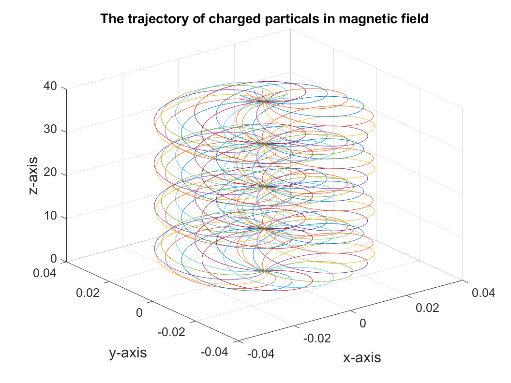

# Engineering Electromagnetic Field Experiment 4 Report

This is the report for the first experiment of Engineering Electromagnetic Field course, written by HUANG Guanchao, SID 11912309 from SME. The complete resources of this experiment, including `.m` source code, report in `.md`, `.pdf` format and all the figures can be retrieved at [my GitHub repo](https://github.com/SamuelHuang2019/EEF-lab/tree/main/experiment_4).

>These works are done with MATLAB 2020b and VSCode.

[toc]

---

## Objectives

1. Understand Lorentz force that is applied on a charge in a magnetic field.
2. Use MATLAB to analyze the charge’s movement trajectory in the magnetic field.

---

## Related Knowledge

Charge in magnetic field will be subject to the action of Lorentz force, which is expressed as:

$$
\mathbf{F} = q\mathbf{E} + q\mathbf{v}\times\mathbf{B}.\tag{1}
$$

Where $\mathbf{F}$ is vector of Lorentz force, $\mathbf{E}$ is the vector of electric field, $\mathbf{B}$ is the vector of magnetic flux density, $\mathbf{v}$ is the vector of charge’s velocity, $q$ is the quantity of charge.

According to Newton’s law of motion, charge will be accelerated under Lorentz force, hence the velocity and displacement will change. In the 3D Cartesian coordinate system, this process can be described by the following vector equations:

$$
\mathbf{E}(t) =
E_x(t)\mathbf{a}_x +
E_y(t)\mathbf{a}_y +
E_z(t)\mathbf{a}_z\tag{2}
$$

$$
\mathbf{B}(t) =
B_x(t)\mathbf{a}_x +
B_y(t)\mathbf{a}_y +
B_z(t)\mathbf{a}_z\tag{3}
$$

$$
\mathbf{F}(t) = q\mathbf{E}(t) + q\mathbf{v}(t\times\mathbf{B}(t)\tag{4}
$$

$$
\mathbf{A}(t) = \frac{\mathbf{F}(t)}{m}\tag{5}
$$

>Newton’s second law; $m$ is the mass of the charge; $\mathbf{A}$ is the acceleration vector.

$$
\mathbf{v}(t) = \mathbf{v}(0) + \int_0^t \mathbf{A}(t)\mathop{dt}\tag{6}
$$

$$
\mathbf{r}(t) = \mathbf{r}(0) + \int_0^t\mathbf{v}(t)\mathop{dt}\tag{7}
$$

>$\mathbf{r}$ is the position vector.

It can be seen that this is a process that develops over time. In some cases, this process can be solved analytically by solving differential equations to get the velocity vector, position vector at every moment. This experiment is aimed to analyze this dynamic process without tedious mathematical derivation. The key point is to understand the physical essence of this dynamic process. Therefore, we discretize time and introduce small time-step $\Delta t$. And we assume at each time slot, the acceleration vector will not change. In this way, equation $(6)$ and $(7)$ can be rewritten as:

$$
\mathbf{v}(t + \Delta t) = \mathbf{v}(t) + \mathbf{A}(t)\Delta t\tag{8}
$$

$$
\mathbf{r}(t + \Delta t) = \mathbf{r}(t) + \mathbf{v}(t)\Delta t\tag{9}
$$

Then we can use MATLAB program to analyze the velocity and position vectors at each time slot. Meanwhile, the charge’s movement trajectory during a period of time can be plotted.

>Note:
>
>1. The time-step should be set appropriately. If it is too long, then error will be large; if it is too small, the computation will be time-consuming.
>
>2. Equations $(4)$ – $(9)$ are vector expressions, so 3-D dimensional components should be considered in MATLAB programming.

---

## Experiment Content

Use MATLAB to analyze the magnetic focusing phenomenon. For a beam of charged particles with small angle of divergence, given the same velocity component at the direction of the magnetic field $\mathbf{B}$, their trajectory will have the same screw pitch. After a period, they will converge at another point. The phenomenon that the diverged charged particles focus at one point is similar to the phenomenon that lens can let the light beam focus at one point. Therefore, it is called as magnetic focusing.

Conditions for magnetic focusing:

- The charged particles have similar initial velocity $\mathbf{v}$;
- The angle between $\mathbf{v}$ and $\mathbf{B}$ is sufficiently small so that each particle will do helical motion.

Situation:

- $16$ charges, they have equal mass $m = 0.02\;\mathrm{kg}$ and each carries $q = 0.016\;\mathrm{C}$.
- The initial velocities are the same: $\mathbf{r}(0) = 0$ (at the origin of the coordinate).
- Electric field: $\mathbf{E} = 0$;
- Magnetic flux density: $\mathbf{B} = 8\mathbf{a}_z\;\mathrm{Wb/m^2}$.
- These 16 charges' initial velocities along $z$-axis are equal: $v_z(0) = 10\;\mathrm{m/s}$.
- Their initial velocities along $x$-axis and $y$-axis can be expressed as:
$$
\begin{cases}
v_x(0) = 0.1\sin\dfrac{k\pi}{8}\;\mathrm{m/s} \\
v_y(0) = 0.1\cos\dfrac{k\pi}{8}\;\mathrm{m/s} \\
\end{cases}
$$

where $k = 0, 1, 2, ..., 15$.

---

## Code Implementation

Since there are 16 particles required to be analyzed, the position, force, acceleration and velocity of the particles are stored in a matrix, with rows representing different particles.

```matlab
% Construct the velocity vector
vx = zeros(16, length(t));
vy = vx;
vz = vx;
% Set the velocity vector's initial value.
for k = 0:15
    vx(k + 1, 1) = 0.1 * sin(k * pi / 8);
    vy(k + 1, 1) = 0.1 * cos(k * pi / 8);
end

vz(:, 1) = 10 * ones(16, 1);

% Set the position vector
rx = zeros(16, length(t));
ry = rx;
rz = rx;

% Construct the force vector；
Fx = zeros(16, length(t));
Fy = Fx;
Fz = Fx;

% Construct the acceleration vector
ax = zeros(16, length(t));
ay = ax;
az = ax;
```

Then, these quantities are evaluated in loop.

```matlab
% Calculate each position point
for i = 1:16

    for j = 1:(length(t) - 1)
        % Calculate the acted force at position j
        Fx(i, j) = q * Ex + q * (vy(i, j) * Bz - vz(i, j) * By);
        Fy(i, j) = q * Ey + q * (vz(i, j) * Bx - vx(i, j) * Bz);
        Fz(i, j) = q * Ez + q * (vx(i, j) * By - vy(i, j) * Bx);

        % Calculate the acceleration at position j
        ax(i, j) = Fx(i, j) / m;
        ay(i, j) = Fy(i, j) / m;
        az(i, j) = Fz(i, j) / m;

        % Calculate the velocity at position j + 1
        vx(i, j + 1) = vx(i, j) + ax(i, j) * dt;
        vy(i, j + 1) = vy(i, j) + ay(i, j) * dt;
        vz(i, j + 1) = vz(i, j) + az(i, j) * dt;

        % Calculate the position at point j + 1
        rx(i, j + 1) = rx(i, j) + vx(i, j) * dt;
        ry(i, j + 1) = ry(i, j) + vy(i, j) * dt;
        rz(i, j + 1) = rz(i, j) + vz(i, j) * dt;
    end

end
```

Similarly, the trajectories are plotted in loop.

```matlab
figure
% Plot
for i = 1:16
    plot3(rx(i, :), ry(i, :), rz(i, :))
    hold on
end
```

## Experiment Result

The result is shown in the figure below.



It is clear that, the particles are exited from origin, then diverge, then refocusing at one point, and continue this process.
